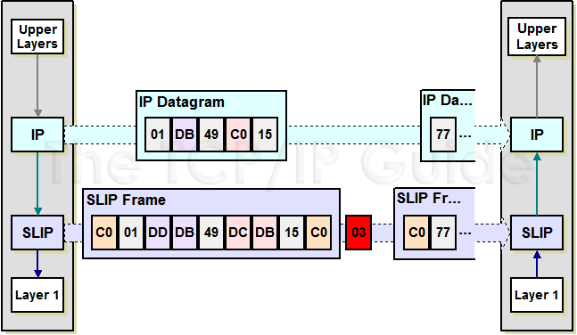

### Serial Line Internet Protocol (SLIP) for Arduino


### How SLIP works

[More details on SLIP](http://216.92.67.219/free/t_SerialLineInternetProtocolSLIP-2.htm)


	|Arduino(10.10.10.2)| <===========SLIP(USB-to-Serial Connector)===========>  |Linux Host(10.10.10.1)|

### Setup on Linux Host
  * git clone https://github.com/contiki-os/contiki.git
  * cd contiki/tools
  * make
  * sudo ./tunslip -B 115200 -s /dev/ttyUSB0 10.10.10.1 255.255.255.0
  * sudo ifconfig tun0 10.10.10.1/24


### Setup of Aruduino
  * Configure parameters in SLIP.ino
  * Upload SLIP.ino to Arduino
  
#### Instantiate slip network
```
/*
 SerialN -> Serial, Serial1, Serial2, Serial3
 baudrate -> 115200
*/
slip network = slip(SerialN, baudrate);

/*
 Set IP to 10.10.10.2
*/
uint32_t myIP = 10UL<<24 | 10UL<<16 | 10UL <<8 | 2;
network.init(myIP);
```

#### TCP Client Example [Make a web request to a HTTP Server runing on Linux Host ]

 - Setup a web server on the linux host -> `python3 -m http.server 9000`
 - Now we can use the tcpClient on Arduino

```
   uint32_t destIP = (10UL<<24 | 10UL << 16 | 10UL << 8 | 1);
   uint16_t random_src_port = random(1500, 10000);
   #define DATA "GET / HTTP/1.1\r\n\r\n"
   network.tcpClient(destIP, 9000,random_src_port, (uint8_t*)DATA, String(DATA).length(), tcpRXcb ,5);
```
 - tcpRXcb is the callback when data is received from the HTTP Server after the request is made
 - tcpRXcb takes two parameters 
	- 1. uint8_t* rx -> pointer to the received data 
	- 2. uint8_t  rxlen -> length of received data
 
 - Check the example code (.ino) file to get an idea of how to use the callback to print the received data on the Arduino Serial Monitor 

#### TCP Server Example [Host a web server on the Arduino]
 - Only one TCP Server can be hosted on the Arduino, which can bind to any TCP Port - 7000 in our example
 - Code the Arduino to listen on the port 7000 (Any port can be used)
 - `network.tcpCBregister(7000, tcp_server);`
 - tcpServer is the callback when data arrives on the TCP port 7000
 - tcpServer takes 3 parameters and returns a uint8_t value
	- 1. uint8_t* rx -> pointer to the data(web request if we are implementing an HTTP Server) received
	- 2. uint8_t rxlen -> length in bytes of received data(request)
	- 3. uint8_t* tx -> pointer to data that has to be sent back (response)
	- and tcpServer returns txlen -> length in bytes of the data (response) to be sent back 
 - Check the example code in the .ino file to get more details about how to construct an HTTP Response.

 - Now that the code is ready on the Arduino, we can use curl on the linux host to make a web request like this -
 - `curl -v 10.10.10.2:7000`

#### UDP Client Example
 - The Arduino can send data to a UDP Server listening on the linux host machine
 - Setup a UDP Server on linux side which listens on port 9000 -> `nc -lup 9000`
 
 - On the Arduino, we use the code ->
``` 
    uint8_t rx[10];
    uint8_t rxlen=network.udpClient(destIP, 9000, 2000, (uint8_t*)"Hare Krishna Hare Rama", 22, rx,5); 
```
 - udpClient takes 7 Parameters and returns the number of bytes returned from the server
  
	- 1 -> uint32_t destination IP
	- 2 -> uint16_t destination Port
	- 3 -> uint16_t source Port
	- 4 -> uint8_t* txdata
	- 5 -> uint8_t  txlen
	- 6 -> uint8_t* rxdata = data received
	- 7 -> uint8_t  rx_timeout in seconds [ 0 to send txdata and return immediately]
	- returns -> rxlen = length of data received
 
 - Check the code in the ino example file to get some more details

 
#### UDP Server Example

 - We can host upto 5 UDP Servers running on 5 UDP ports on the Arduino
 - We can register two UDP Servers on the Arduino at UDP Ports 5000 and 6000 like this ->
 - `network.udpCBregister(5000, udp_echo_server);`
 - `network.udpCBregister(6000, udp_handler_6000);` 
 - **udp_echo_server** and **udp_handler_6000** are callbacks when data is received on UDP ports 5000 and 6000 respectively
 - The **udp_echo_server** echoes back the data  received.
 - Check the example code in the .ino file to get more details about how the udp_echo_server is implemented.

 - On the Linux host, we can use netcat (or nc) command to talk to the UDP Server on the Arduino ->
 - nc -u 10.10.10.2 5000
 - Then type some text and hit enter to see the echo from the Arduino **udp_echo_server**
 - nc -u 10.10.10.2 6000 
 - Then type something and hit enter to see Arduino reply back with the number of bytes it received on the UDP port 6000

